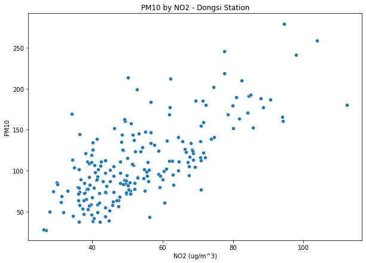
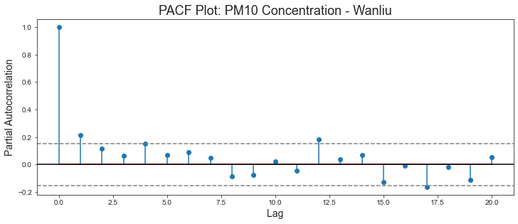
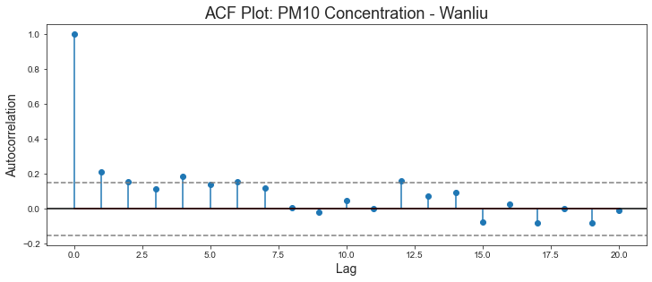

# Forecasting Air Pollution in Beijing for United Nations Environment Programme (UNEP)


## Organizational Objective

The city of Beijing, China is one of the most populous cities in the world with over 21.5 million residents. Due to its economic opportunities, entertainment options, and public commodities - people have flocked to city. Unfortunately Beijing has a mass air pollution problem.  Air pollutants like particulate matter 10 (PM10) - particles in the air like dust, dirt, and soot, can result in a number of negative health impacts ranging from coughing and wheezing to asthma attacks and bronchitis to high blood pressure, heart attack, strokes, and premature death. Any level of PM10 is not good but keeping exposure to PM10 concentrations below 54.0 µg/m³ is the best way to prevent any short or long-term health effects from developing. Below is a chart of PM10 Air Quality Index.


Therefore UNEP, has tasked me with forecasting air pollutant PM10 in Beijing to obtain a better understanding of what could happen to air quality as more and more cities become densely populated, as well as what can be done to remedy it. 

#### Disclaimer: This is a HYPOTHETICAL objective. The UNEP did not request this of me.

## Main Findings

1. The best forecasting of pollutant PM10 was with models that took into account seasonality whether it be variations that occur yearly, monthly, or weekly. 
2. There is a positive linear relationship between NO2 (caused by fossil fuels) and PM10. 
3. There is an overall air pollution decline.

## The Notebooks

Have four notebooks in total. 

1. [All Stations Exploration](./district_exploration.ipynb). It includes: 
    - Inital exploration of all stations - .head(), .info()
    - Checking if there are any nulls in the .csv files.
    - Gathering population and city district location of the stations.
    - Decision on which stations to proceed with.

2. [Daily Average Forecast](./air_pollution_forecast.ipynb). It includes:
    - Reading in the remaining 9 .csv files I decided to forecast.
    - Preparation of dataframes for time series modeling.
    - Exploration of dtype object column `wd`.
    - Resampling of daily average.
    - Distribution plots and line plots of the stations.
    - Train/test split.
    - Stationarity check and null imputation.
    - Basline model, AR model, MA, ARIMA model for all stations.
    - PACF & ACF plots for each station.

3. [Weekly Average Forecast](./weekly_air_pollution_forecast.ipynb). It includes:
    - All that was done in Daily Average Forecast but with weekly.

4. [Main Notebook](./station_forecasting_main.ipynb). It includes:
    - All that was done in Weekly Average with 4 stations instead.
    - 4 stations that were narrowed downed based on location and population of district.
    - More modeling of ARIMA tuned by ACF & PACF charts.
    - SARIMA model, SARIMAX model.
    - Visualization of time series.
    - Conclusion.

## Data Cleaning

There were 12 stations to begin with, two of them, Aotizhongxin and Wanshouxigong,  are not located within Beijing and Dingling which is also located in the Changping District. Therefore did not do any forecasting with these stations and they were only explored in [All Stations Exploration](./district_exploration.ipynb) notebook. 

As mentioned above in the main notebook - `station_forecasting_main.ipynb` I chose to explore further the following stations Changping, Dongsi, Huairou, and Wanliu. These stations were chosen based on their district's proximity to the city center. 

To prepare the data for a time series model I set the time columns - `year`, `month`, `day`, and `hour`  to a DateTime data type and set it as the index. I also resampled the dataframes to a weekly average. Before the resampling each dataframe they had ~35K observations each, afterwards had 210.   

## Exploratory Data Analysis 

### Population and Districts of Stations

Through outside data gathering of population and district location found that the closer to the city center the larger the median value of PM10 concentration. The highest being Wanliu and Dongsi Station - 102.9 and and 102.5 respectively. Also found that population doesn't have much to do with the concentration of PM10. Below is a map of the districts of city of Beijing. Wanliu and Dongsi are located in the Haidan and Dongsheng districts respectively. 


<table>
  <tr>
    <th>Station Name</th>
    <th>Median of PM10 (μg/m3)</th>
    <th>Population (2016)</th>
    <th>District</th>
  </tr>
  <tr>
    <td>Changping</td>
    <td>85.6</td>
    <td>2.010 million</td>
    <td>Changping</td>
  </tr>
  <tr>
    <td>Dongsi</td>
    <td>101.5</td>
    <td>878,000</td>
    <td>Dongsheng</td> 
  </tr>
  <tr>
    <td>Huairou</td>
    <td>83.1</td>
    <td>393,000</td>
    <td>Huairou</td> 
  </tr>
  <tr>
    <td>Wanliu</td>
    <td>102.9</td>
    <td>3.593 million</td>
    <td>Haidan</td> 
  </tr>
</table>

###  NO2 and its relationship with PM10



From the plot above can see that air pollutant NO2 had the highest positive correlation with PM10 compared to other pollutants like carbon monoxide (CO). NO2 is caused by the burning of fossil fuels like coal mining and chemical plants. These industries can be found in nearby districts of Beijing, such as the Changping and Fangshang districts. The highest correlation was with Wanliu which can be see with the correlation heatmap of Wanliu Station below: 


Can see that in Wanliu PM10 had a correlation with NO2 of 0.8.

### Line Plots 


The above chart is for the average weekly PM10 for Changping Station. The charts for the other stations Dongsi, Huairou, and Wanliu were similar.
 
- There are no obvious patterns in the PM10 time series plot.
- There does not appear to be a general trend increasing or decreasing.
- There may be a seasonal variation where there are some spikes. For example in 2016 for Changping, Dongsi, and Wanliu there was a spike in beginning of 2016 because there was a red alert issued from previous severe smog.

### Decomposition of Line Plots  


Once again the above chart is only for the Wanliu Station; however, the charts for the other stations showed similar trends, seasonal, and residuals.

<b>Observations</b> 
- The Observed plot shows the average weekly PM10 values.
- The Trend plot indicates that there is an overall decreasing trend for the stations.
- The Seasonal plot identifies repeating patterns that reach their lowest value about 60% of the way through each year. The maximum values are near the start of each year.
- The Residual plot reflects the remaining noise in the dataset after removing the other variation types. There are no patterns present.


## Forecasting PM10 in Beijing

For the time series, I tried forecasting both the daily average of PM10 and weekly avergae of PM10. In the end, I decided to go with weekly average for the final model because realistically not much can be done on a day to day basis especially with something as complex as air pollution. However the daily average forecasting can be found [here](./air_pollution_forecast.ipynb)

<b>Evaluation Metric</b>

- Root mean squared error (RMSE): wanted to minimize error in forecasting; get as close to the actual value.
- Akaike Information Criterion (AIC):  estimates the relative quality of statistical models for a given set of data and takes into account the complexity of a model along with how well a model fits the data

Tried several models such as basic shifts, AR, MA, ARIMA, and SARIMA models. I plotted the Partial Autocorrelation chart and Autocorrelation chart in order to tune the ARIMA models. In the end the SARIMA models gave the best AIC scores while the ARIMA gave the best RMSE score. The SARIMA model was the final model because the AIC score shows how well the model is performing compared to others. Therefore although ARIMA gave a better RMSE, SARIMA models performed better in comparison. Below is the PACF and ACF charts for the Wanliu Station: 


<br>


### Changping Station 


AIC Score: 1,242.464
<br>
RMSE: 41.88 μg/m3

The model performed fairly well for the Changping Station, all the observations are within the 95% confidence interval; meaning that 95% of the time the true population mean will fall within that shaded grey area and and a 5% chance that it will not. The standard deviation for PM10 in Changping was 41.12 μg/m3 with the RMSE for SARIMA being 41.88 μg/m3 which is only slightly above it.


### Dongsi Station 


AIC Score: 1,279.405
<br>
RMSE: 54.61 μg/m3

The model performed fairly well for the Dongsi station, all the observations are within the 95% confidence interval; meaning that 95% of the time the true population mean will fall within the shaded grey area and and a 5% chance that it will not. The standard deviation for PM10 in Dongsi was 47.06 μg/m3 with the RMSE for SARIMA being 54.6 μg/m3. The RMSE was 7.54 μg/m3 above it. 

### Huairou Station 


AIC Score: 1,264.071
<br>
RMSE: 40.81 μg/m3

The model performed fairly well for the Huairou station, all the observations are within the 95% confidence interval; meaning that 95% of the time the true population mean will fall within the shaded grey area and and a 5% chance that it will not. The standard deviation for PM10 in Huairou was 40.45 μg/m3 with the RMSE for SARIMA being 40.81 μg/m3 which is only slightly above it. 

### Wanliu Station 


AIC Score: 1,256.048
<br>
RMSE: 51.19 μg/m3

The model performed fairly well for the Wanliu station, most of the observations are within the 95% confidence interval except for one at `2017-01`. The standard deviation for PM10 in Wanliu was 45.45 μg/m3 with the RMSE for SARIMA being 51.19 μg/m3 which is 5.74 μg/m3 above it. 

## Conclusion and Recommendations 

In conclusion found that a SARIMA Model gave the best forcasting in terms of AIC score (model performance). The RMSE was better for the ARIMA model; however its AIC score was above 1,700 compared to around the 1,200 for SARIMA. I also found that there is a very strong positive correlation between the feature NO2 and target variable PM10. Finally, the air pollution is on a overall decline in Beijing. 

The recommendations I would give to the UNEP are:
1. SARIMA models provide the best forecasting.
2. Implement a similar program for districts in Beijing such as the Toxics Release Inventory Program here in the United States - where industrial and federal facilities report their pollution prevention activities will encourage industries that contribute heavily to air pollution in becoming more sustainable and environmentally friendly.
3. The UNEP should team up with big tech industries, like Xiaomi who reside in the Haidian district, and plan to take necessary steps towards carbon neutrality through the way they manufacture their products. 

## Future Insights

Some of the future steps that I would like to take is to analyze current trends on air pollution. As mentioned above air pollution is on the overall decline in Beijing; therefore I would like to see if that trend continued amongst the pandemic, movement towards electric vehicles, and enviornmental laws that China has enacted more recently. 

I would also like to add health data from the districts in which the station were located such as how many people have asthma and if that number has grown over the years. And finally I would also like to add the monitoring equipment data such as how old is it and if it is prone to give misreadings. 


Would also like to deploy this model in a dashboard in Tableau so stay tune for that!


## For More Information
Please review the full analysis in the [main Jupyter Notebook](./station_forecasting_main.ipnyb) or the [presentation](./presentation.pdf).
 
For any additional questions, please contact **Juana Tavera | tvrjuana@gmail.com
 
## Repository Structure
```
├── README.md                                 <- The top-level README for reviewers of this project
├── station_forecasting_main.ipynb            <- Narrative documentation of analysis in Jupyter notebook
├── district_exploration.ipynb                <- Initial exploration of all stations
├── air_pollution_forecast.ipynb              <- Daily average forecasting all stations
├── weekly_air_pollution_forecast.ipynb       <- Weekly average forecasting for all stations 
├── presentation.pdf                          <- PDF version of project presentation
├── data                                      <- Both sourced externally and generated from code
└── images                                    <- Both sourced externally and generated from code
```
