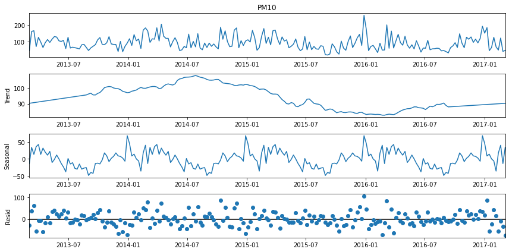

# Forecasting Air Pollution in Beijing for UNEP


## Organizational Objective

The city of Beijing, China is one of the most populous cities in the world with over 21.5 million residents. Due to its economic opportunities, entertainment options, and public commodities - people have flocked to city. Unfortunately this adds to its air pollution problem. Air pollution effects both the environment and humans negatively. The ultimate goal is to accurately forecast the air pollutant PM10 in order for governmental, health, and environmental leaders to take the necessary steps to remedy this problem and improve health for areas like Beijing that struggle with PM10.

Exposure to PM10 (particulate matter) can result in a number of health imapcts ranging from coughing and wheezing to asthma attacks and bronchitis to high blood pressure, heart attack, strokes, and premature death. Any level of PM10 is not good but keeping exposure to PM10 concentrations below 54.0 µg/m³ is the best way to prevent any short or long-term health effects from developing. Below a chart of PM10 Air Quality Index.


## Main Findings

## The Notebooks

Have four notebooks that include initial exploration of the stations in `district_exploration.ipynb`, the average daily forecasting for all stations in `air_pollution_forecast`, the average weekly forecasting for all stations in `weekly_air_pollution_forecast.ipynb`, and the average weekly forecasting for stations Changping, Dongsi, Huairou, and Wanliu in `station_forecast_main.ipnyb`. `station_forecast_main.ipnyb` is the main notebook.

## Data Cleaning

There were 12 stations to begin with, two of them (Aotizhongxin and Wanshouxigong) are not located within Beijing, and Dingling which is also located in the Changping District; therefore did not do any forecasting with these stations. 

The rest of the station were used and each have the following air pollutants PM2.5, PM10, NO2, SO2, CO, and O3. They also have values like temperature, pressure, and wind direction. Before resampling to weekly average each dataset had ~35K observations, afterwards had 210.

## EDA

(will add more EDA)


The above chart is for the average weekly PM10 for Changping Station. The charts for the other stations Dongsi, Huairou, and Wanliu were similar.

<b>Observations</b> 
- There are no obvious patterns in the PM10 time series plot.
- There does not appear to be a general trend increasing or decreasing.
- There may be a seasonal variation where there are some spikes at the beginning to the mid of the year. 




Once again the above chart is only for the Changping Station; however, the charts for the other stations showed similar trends, seasonal, and residuals.

<b>Observations</b> 
- The Observed plot shows the average weekly PM10 values.
- The Trend plot indicates that there is an overall decreasing trend for the stations.
- The Seasonal plot identifies repeating patterns that reach their lowest value about 60% of the way through each year. The maximum values are near the start of each year.
- The Residual plot reflects the remaining noise in the dataset after removing the other variation types. There are no patterns present.


## Forecasting PM10 in Beijing

For the time series, I tried forecasting both the daily average of PM10 and weekly avergae of PM10. In the end, I decided to go with weekly average for the final model because realistically not much can be done on a day to day basis especially with something as complex as air pollution. However the daily average forecasting can be found [here](./air_pollution_forecast.ipynb)

Tried several models such as basic shifts, AR, MA, ARIMA, and SARIMA models. The SARIMA models gave the best AIC scores; however the ARIMA gave the best root mean squared error (RMSE) score. The SARIMA model was the final model because AIC is more important for time series.


AIC Score: 1242.464
RMSE: 41.88


AIC Score: 1279.405
RMSE: 54.61


AIC Score: 1264.071
RMSE: 40.81


AIC Score: 1256.048
RMSE: 51.19


## For More Information
Please review the full analysis in the [main Jupyter Notebook](./station_forecast_main.ipnyb) or the [presentation](./presentation.pdf).
 
For any additional questions, please contact **Juana Tavera | tvrjuana@gmail.com
 
## Repository Structure
```
├── README.md                              <- The top-level README for reviewers of this project
├── station_forecast_main.ipynb            <- Narrative documentation of analysis in Jupyter notebook
├── presentation.pdf                       <- PDF version of project presentation
├── data                                   <- Both sourced externally and generated from code
└── images                                 <- Both sourced externally and generated from code
```

<b>Stakeholder:</b> Ministry of Environmental Protection of the People's Republic of China OR United Nations Environment Programme