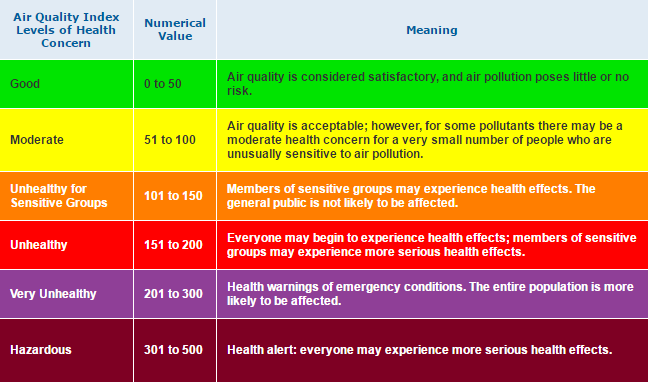

# Forecasting Air Pollution in Beijing for United Nations Environment Programme (UNEP)


## Organizational Objective

The city of Beijing, China is one of the most populous cities in the world with over 21.5 million residents. Due to its economic opportunities, entertainment options, and public commodities - people have flocked to city. Unfortunately this adds to its air pollution problem. Air pollution effects both the environment and humans negatively. The ultimate goal is to accurately forecast the air pollutant PM10 in order for governmental, health, and environmental leaders to take the necessary steps to remedy this problem and improve health for areas like Beijing that struggle with PM10.

Exposure to PM10 (particulate matter) can result in a number of health imapcts ranging from coughing and wheezing to asthma attacks and bronchitis to high blood pressure, heart attack, strokes, and premature death. Any level of PM10 is not good but keeping exposure to PM10 concentrations below 54.0 µg/m³ is the best way to prevent any short or long-term health effects from developing. Below a chart of PM10 Air Quality Index.



## Main Findings

1. The best forecasting of pollutant PM10 was with models that took into account seasonality whether it be variations that occur yearly, monthly, or weekly. 
2. There is a positive linear relationship between NO2 (caused by fossil fuels) and PM10. 
3. There is an overall air pollution decline.

## The Notebooks

Have four notebooks in total. 

1. [All Stations Exploration](./district_exploration.ipynb). It includes: 
    - Inital exploration of all stations - .head(), .info()
    - Checking if there are any nulls in the .csv files.
    - Gathering population and city district location of the stations.
    - Decision on which stations to proceed with.

2. [Daily Average Forecast](./air_pollution_forecast.ipynb). It includes:
    - Reading in the remaining 9 .csv files I decided to forecast.
    - Preparation of dataframes for time series modeling.
    - Exploration of dtype object column `wd`.
    - Resampling of daily average.
    - Distribution plots and line plots of the stations.
    - Train/test split.
    - Stationarity check and null imputation.
    - Basline model, AR model, MA, ARIMA model for all stations.
    - PACF & ACF plots for each station.

3. [Weekly Average Forecast](./weekly_air_pollution_forecast.ipynb). It includes:
    - All that was done in Daily Average Forecast but with weekly.

4. [Main Notebook](./station_forecast_main.ipynb). It includes:
    - All that was done in Weekly Average with 4 stations instead.
    - 4 stations that were narrowed downed based on location and population of district.
    - More modeling of ARIMA tuned by ACF & PACF charts.
    - SARIMA model, SARIMAX model.
    - Visualization of time series.
    - Conclusion.

## Data Cleaning

There were 12 stations to begin with, two of them, Aotizhongxin and Wanshouxigong,  are not located within Beijing and Dingling which is also located in the Changping District. Therefore did not do any forecasting with these stations and they were only explored in [All Stations Exploration](./district_exploration.ipynb) notebook. 

As mentioned above in the main notebook - `station_forecast_main.ipynb` I chose to explore further the following stations Changping, Dongsi, Huairou, and Wanliu. These stations were chosen based on their district's proximity to the city center. 

To prepare the data for a time series model I set the time columns - `year`, `month`, `day`, and `hour`  to a DateTime data type and set it as the index. I also resampled the dataframes to a weekly average. Before the resampling each dataframe ~35K observations, afterwards had 210.   

## Exploratory Data Analysis 

### Population and Districts of Stations

Through outside data gathering of population and district location found that the closer to the city center the larger the median value of PM10 concentration. The highest being Wanliu and Dongsi Station - 102.9 and and 102.5 respectively. Also found that population doesn't have much to do with the concentration of PM10. Below is a map of the districts of city of Beijing. Wanliu and Dongsi are located in the Haidan and Dongsheng districts respectively. 


<table>
  <tr>
    <th>Station Name</th>
    <th>Median of PM10 (μg/m3)</th>
    <th>Population (2016)</th>
    <th>District</th>
  </tr>
  <tr>
    <td>Changping</td>
    <td>85.6</td>
    <td>2.010 million</td>
    <td>Changping</td>
  </tr>
  <tr>
    <td>Dongsi</td>
    <td>101.5</td>
    <td>878,000</td>
    <td>Dongsheng</td> 
  </tr>
  <tr>
    <td>Huairou</td>
    <td>83.1</td>
    <td>393,000</td>
    <td>Huairou</td> 
  </tr>
  <tr>
    <td>Wanliu</td>
    <td>102.9</td>
    <td>3.593 million</td>
    <td>Haidan</td> 
  </tr>
</table>

###  NO2 and its relationship with PM10


From the plot above can see that air pollutant NO2 had the highest positive correlation with PM10 comapred to other pollutants like carbon monoxide (CO). The highest correlation was with Dongsi which can be see with the correlation heatmap of Wanliu Station below: 


Can see that in Wanliu PM10 had a correlation with NO2 of 0.8.

### Line Plots 


The above chart is for the average weekly PM10 for Changping Station. The charts for the other stations Dongsi, Huairou, and Wanliu were similar.

<b>Observations</b> 
- There are no obvious patterns in the PM10 time series plot.
- There does not appear to be a general trend increasing or decreasing.
- There may be a seasonal variation where there are some spikes. For example in 2016 for Changping, Dongsi, and Wanliu there was a spike in beginning of 2016 because there was a red alert issued from previous severe smog.

### Decomposition of Line Plots  


Once again the above chart is only for the Changping Station; however, the charts for the other stations showed similar trends, seasonal, and residuals.

<b>Observations</b> 
- The Observed plot shows the average weekly PM10 values.
- The Trend plot indicates that there is an overall decreasing trend for the stations.
- The Seasonal plot identifies repeating patterns that reach their lowest value about 60% of the way through each year. The maximum values are near the start of each year.
- The Residual plot reflects the remaining noise in the dataset after removing the other variation types. There are no patterns present.


## Forecasting PM10 in Beijing

For the time series, I tried forecasting both the daily average of PM10 and weekly avergae of PM10. In the end, I decided to go with weekly average for the final model because realistically not much can be done on a day to day basis especially with something as complex as air pollution. However the daily average forecasting can be found [here](./air_pollution_forecast.ipynb)

Tried several models such as basic shifts, AR, MA, ARIMA, and SARIMA models. The SARIMA models gave the best AIC scores; however the ARIMA gave the best root mean squared error (RMSE) score. The SARIMA model was the final model because AIC is more important for time series.


AIC Score: 1242.464
<br>
RMSE: 41.88


AIC Score: 1279.405
<br>
RMSE: 54.61


AIC Score: 1264.071
<br>
RMSE: 40.81


AIC Score: 1256.048
<br>
RMSE: 51.19

## Future Insights

(will add future insights here)


## For More Information
Please review the full analysis in the [main Jupyter Notebook](./station_forecast_main.ipnyb) or the [presentation](./presentation.pdf).
 
For any additional questions, please contact **Juana Tavera | tvrjuana@gmail.com
 
## Repository Structure
```
├── README.md                              <- The top-level README for reviewers of this project
├── station_forecast_main.ipynb            <- Narrative documentation of analysis in Jupyter notebook
├── 
├── presentation.pdf                       <- PDF version of project presentation
├── data                                   <- Both sourced externally and generated from code
└── images                                 <- Both sourced externally and generated from code
```

<b>Stakeholder:</b> Ministry of Environmental Protection of the People's Republic of China OR United Nations Environment Programme